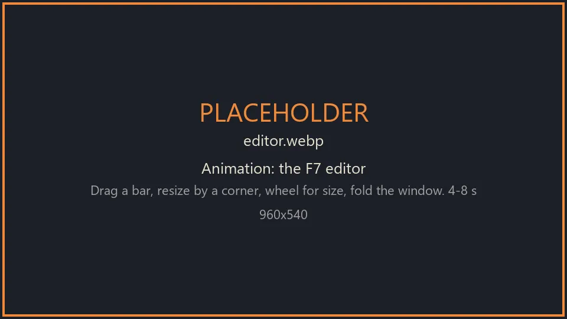

# HudLayout

**English** · [Русский](README-RU.md)

A Valheim mod: move, resize and restyle the player's HUD — the health, stamina, eitr and
adrenaline bars and the food icons. An in-game editor, a choice of styles for every
element, ready-made presets and your own presets. Client-side only: other players and the
server need nothing.

**Status: 1.0.0.** Every build is checked against the current game
assemblies (`check-refs.ps1`). History: [CHANGELOG.md](CHANGELOG.md), plan: [ROADMAP.md](ROADMAP.md).



## What it does

| Element    | Layout                                                        | Look                                                                 |
|------------|---------------------------------------------------------------|----------------------------------------------------------------------|
| Health     | position, scale, length, thickness, fixed length, horizontal / vertical, growth anchor | style, visibility, opacity, number (none / 75 / 75/100 / 75%), number size, bar colour, heart icon |
| Stamina    | same                                                          | same; *Always* keeps it from fading out                              |
| Eitr       | same                                                          | same                                                                 |
| Adrenaline | same                                                          | same                                                                 |
| Food       | position, scale, column / row                                 | style, visibility, opacity, timers on/off, timer size, food symbol   |

- **Styles of an element** — a ready-made look picked per element: bars have *Vanilla,
  Minimal, Numeric, Percent, Faded, Contrast*; food has *Vanilla, IconsOnly, LargeTimers,
  Faded*. Picking one fills in the options; changing any option by hand makes it *Custom*.
- **Presets** describe the whole HUD (all five elements, layout and look). Built-in:
  *Vanilla, Centered, CenteredMinimal, BottomLeft, Minimal, Numbers, AuthorsChoice*. A preset can be applied
  whole, only its layout (positions and sizes) or only its look.
- **Your own presets**: save the current HUD under a name, delete, copy to the clipboard as
  one line and import one from a friend. They are text files in
  `BepInEx/config/j1ga.hudlayout.presets/`, one per preset, editable by hand.

**The rest of the HUD** — hotbar, Forsaken power, status effects, minimap, raid bar, action
progress, stagger bar, mount panel, ship controls, key hints, messages, save and connection
icons — and **other mods' HUD elements** (e.g. ExtraSlots' hotbars) can be moved, resized,
hidden and faded the same way, in the editor, presets and config.

## Edit mode

Press **F7** in the game (`00 General / EditModeKey`). The character stops, a cursor appears,
every element gets a frame, and a window opens with the selected element's options and the
presets.

- **Drag** an element to move it; drag a **yellow corner** to resize it.
- Drag a **blue side handle** of a bar to change its length or thickness.
- **Wheel** over an element: size; **Ctrl+wheel**: bar length; **Shift+wheel**: thickness.
- **Right click**: back to the game's place; **Shift+right click**: reset its whole layout.
- **Arrows** nudge the selected element (Shift ×10); **Tab** selects the next one.
- Positions snap to a grid and to the middle of the screen; hold **Ctrl** while
  dragging to place freely.
- **Esc** or **F7** closes the editor. The config is written once, on closing.

Hidden elements are drawn half-transparent while editing so they can still be found.

## Console

`hudlayout edit | presets | apply <name> [all|layout|style] | save <name> | delete <name> | export [name] | import | reset | dump`

`dump` writes the HUD hierarchy to the BepInEx log — useful when reporting a problem.

## Config

`BepInEx/config/j1ga.hudlayout.cfg`, one section per element (`01 Health` … `05 Food`) and
`00 General`. Everything the editor changes is written there, so ConfigurationManager (F1)
shows and edits the same values live. `PositionX/Y = -1` means "where the game puts it".
Position is a fraction of the screen: `0,0` is the bottom left corner, `1,1` the top right.

`Enabled = false` returns the HUD exactly to the game's version without losing the settings.

## Compatibility

- Mods that **replace** the HUD (Auga and the like) — not compatible, use one or the other.
- Mods that look up the HUD objects **by path** (`hudroot/healthpanel/...`) will not find
  them: the bars now sit one level deeper, in `HudLayout_<Element>` wrappers. Mods holding
  the objects by reference (the usual case) are not affected.
- In build mode and at a ship's helm the game lifts the stamina, eitr and adrenaline bars;
  moved bars are lifted by the same amount (`FollowBuildShift`).

## For mod authors

Anything your mod puts straight into `hudroot` is already movable (section `30 Mod <name>`).
For an object elsewhere (your own canvas), or to give it a proper name, register it — through
reflection, so HudLayout stays optional:

```csharp
Type api = Type.GetType("HudLayout.HudLayoutApi, HudLayout");
if (api != null)
    api.GetMethod("Register", new[] { typeof(string), typeof(RectTransform), typeof(string) })
       .Invoke(null, new object[] { "MyMod.Compass", compassRect, "Compass" });
```

- It is taken over within two seconds; register again (same id) if you recreate the object.
- HudLayout composes its offset, scale and rotation onto your object's pose. Keep setting your
  position as you like: what you write becomes the base. The object stays in your hierarchy
  (`Register(id, rect, name, true)` wraps it instead — only if nothing finds it by path).
- `Unregister(id)` gives it back; `IsEditing` tells whether the editor is open.

## Building

`powershell -ExecutionPolicy Bypass -File .\build.ps1` — builds `build\HudLayout.dll` with
`csc.exe` from the .NET Framework against the installed game and the r2modman profile
(paths at the top of the script), then checks every reference and Harmony target against the
current game (`check-refs.ps1`). `-Install` copies it into the profile's plugins, `-Package`
makes a Thunderstore zip (needs `thunderstore/icon.png`, 256×256).

## Bugs and feedback

GitHub Issues: https://github.com/tbsj1ga/HudLayoutValheim/issues — attach
`BepInEx/LogOutput.log` and a screenshot; `hudlayout dump` (F5 console) writes the HUD layout
into that log.

## License

MIT (`LICENSE`).
